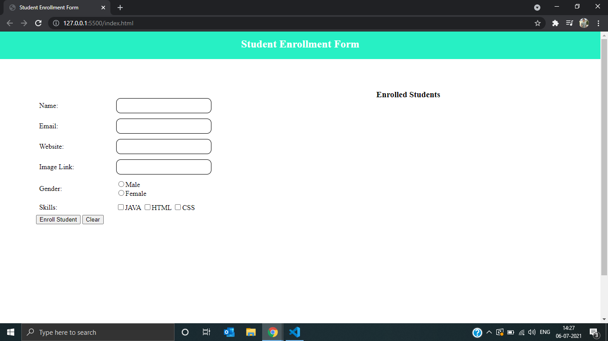
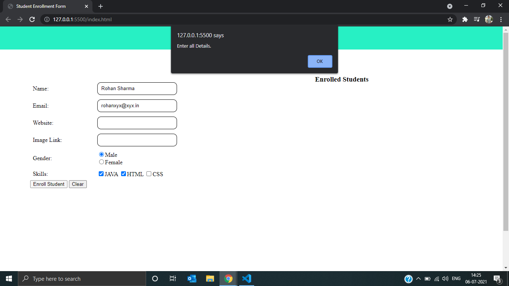
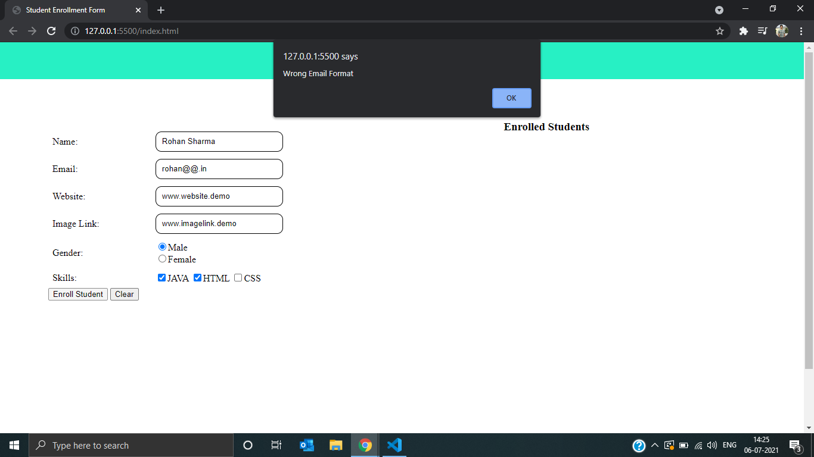
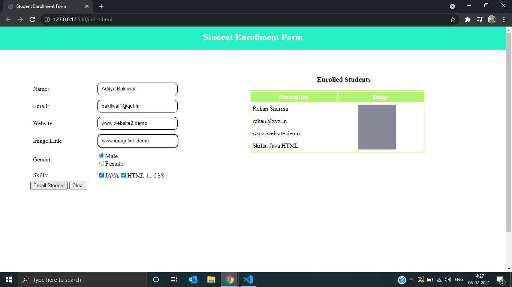
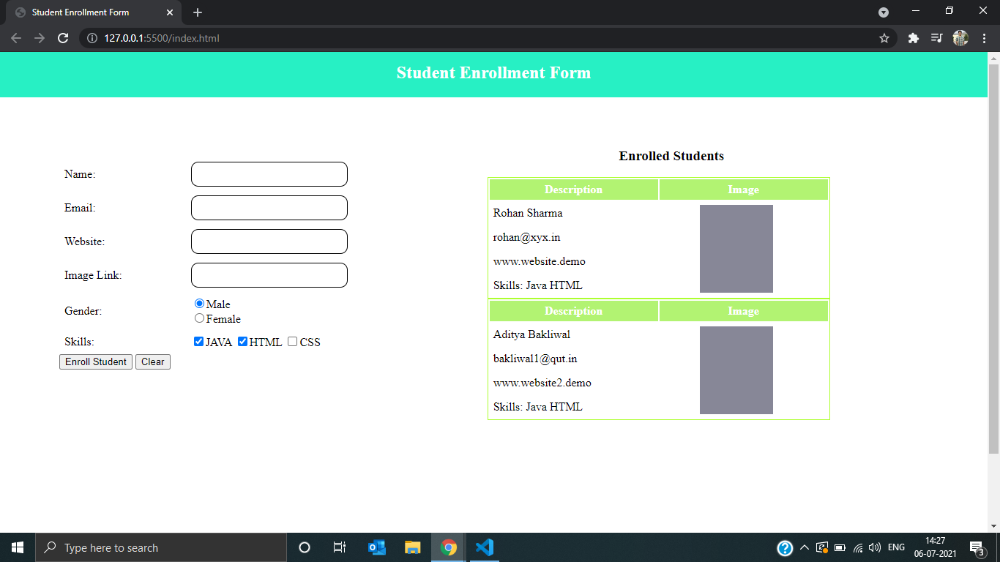

<h4>✔ The enrollment page  created using  HTML, CSS and Javascript.</h4>
<h4>✔ Fields of the form should have some value and correct email format.</h4>
<h4>✔ On form submission the enrolled student is added dynamically to the table using javascript</h4>

